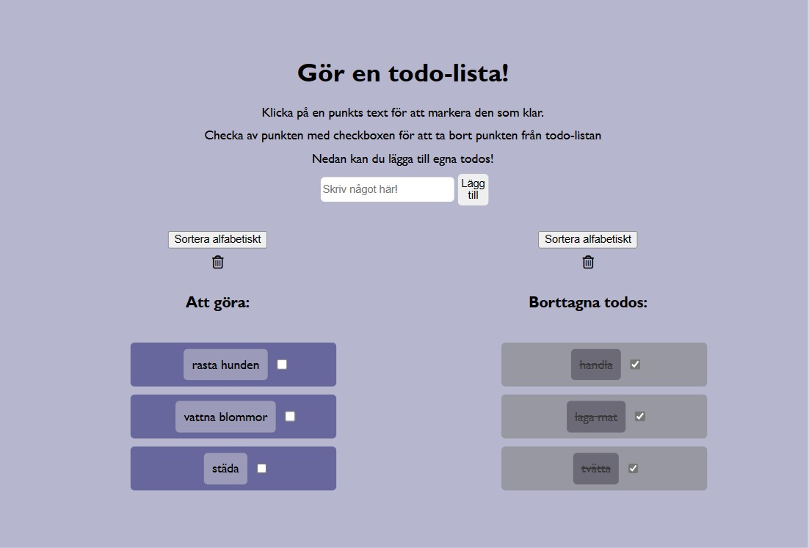

## Description

The goal with this assignment is to practice code refactoring. I use an old project for this assignment and convert it to typescript (if it is in javascript) and refactor at least 3 parts, but aspire to refactor the entire code. Both the logic if needed, structure and styling.

### The todo list

This is a todo list where yoou can add todos from a form. You have to write something in the input box or else the user will get an error message. The todo tasks can be marked as finished and can be removed to the removed list. Both the lists can be emptied and they can be sorted in alphabetical order.

### Commit messages

- (fix) - Used when something is wrong and needs to change logic if the functionality isn't right or there is a bug. Vanilla javascript is not to be used in this assignment so I also use fix-commits when I change javascript into typescript to fix old javascript bugs and errors. Fix is also used when I change bad names for variables and scss selectors.
- (feat) - Used when something new is added, some new function or when I add a new selector to the styling etc.
- (docs) - Commits related to the README file or basic overall comments as documentation to understand each function.
  I don't use optional scopes because the project is very small and only have simple functions with no api request in the project, or any other outside connections. The project is about creating html for 2 lists. There is no need to divide the commits any further.
